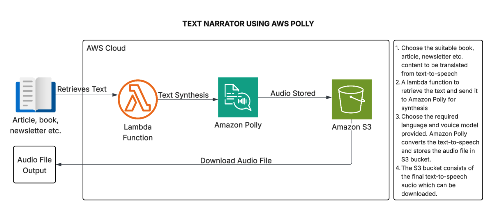

# Text Narration using Amazon Polly 🎙️

## Table of Contents 📚

1. [Project Overview](#project-overview-)
2. [Getting Started with Amazon Polly](#getting-started-with-amazon-polly-)
3. [Creating an IAM Role](#creating-an-iam-role-)
4. [Creating an S3 Bucket](#creating-an-s3-bucket-)
5. [Creating a Lambda Function](#creating-a-lambda-function-)
6. [Testing and Output Verification](#testing-and-output-verification-)
7. [Conclusion & Clean-up](#conclusion--clean-up-)

---

## Project Overview ☁️

In this project, we will be developing a text narrator using Amazon Polly. A piece of text (book, article, newsletter) will be uploaded in an Amazon S3 bucket and converted to speech. The voice, pitch and speed parameters can be adjusted.

### Steps to be performed 👩‍💻

In the next few lessons, we'll be going through the following steps:

1. Exploring Amazon Polly
2. Creating an IAM role
3. Creating an S3 Bucket
4. Writing Lambda function code
5. Checking the output of Amazon Polly

### Services Used 🛠️

- **Amazon Polly**: Converts text to life like speech with customizable features
- **AWS Management Console**: Manages accounts and configures Amazon Polly
- **AWS IAM**: Ensures secure access by managing user permissions
- **AWS Lambda**: Serverless compute service for function execution
- **Amazon S3**: Object storage for audio files

### Estimated Time & Cost ⚙️

- **Time**: This project is estimated to take about 20-30 minutes
- **Cost**: Free (When using the AWS Free Tier)

### Architecture Diagram ➡️

This is the architectural diagram for the project:



---

## Getting Started with Amazon Polly 🎯

### What is Amazon Polly?

Amazon Polly is a service provided by AWS that enables developers to generate human-like speech from text.

#### Key Features:

1. **Text-to-Speech Conversion**: Amazon Polly turns written text into spoken words. So, you can type something, and Amazon Polly will say it out loud in a natural-sounding voice.

2. **Realistic Speech**: The speech created by Amazon Polly sounds like a real person speaking, not robotic or unnatural. It's great for making computerized voices sound more human-like.

3. **Options to Customize**: You can change how the speech sounds. For example, you can make it faster or slower, adjust the pitch (high or low), and even pick different accents or languages.

4. **Supports Many Languages and Voices**: Amazon Polly can speak in lots of different languages and with different voices. Whether you want a man or a woman, or someone with a British or American accent, you have options.

5. **SSML Support for Control**: You can use special codes called SSML to control exactly how the speech sounds. This allows for things like emphasizing certain words, adding pauses, or changing the tone of voice.

### Trying out Amazon Polly 🧪

1. Login to your AWS management console and search for **Amazon Polly** on the search bar.

2. Amazon Polly provides different engines according to the requirements for the sounding of the audio and the content length:

   - **Neural Engine**: Used for lifelike and expressive speech or for natural-sounding interactions
   - **Standard Engine**: Provides good quality speech suitable for most applications
   - **Long Form Engine**: Optimized for longer texts like articles or books that provides good quality throughout the content

3. Amazon Polly also provides different **languages** to translate and different voice tones. So you can use a voice tone according to the need in your application.

4. Choose the language and voice model, type the content you want to be translated in the audio form in the input text box.

5. You can listen to the output using the **Listen** button present on the top right or you can even download the audio or save it in a S3 bucket.

We have seen a quick demo on how Amazon Polly works. In the next few sections we will explore on how to call the Polly service using a serverless function.

---

## Creating an IAM Role 🔐

### Prerequisites

In this project, we will try to access the Amazon Polly service and store the audio output in a S3 bucket using a Lambda function. For that we need an **IAM role** with suitable policies attached to it.

### Step-by-Step Instructions

1. From your **AWS management console**, search for **IAM** from the search bar.

2. Navigate to **Access Management** → **Roles** → **Create Role**.

3. Select **AWS service** as the trusted entity type and **Lambda** as your use case. Click on **Next**.

4. From the list of permission policies, choose the following policies:

   - `AmazonPollyFullAccess`
   - `AmazonS3FullAccess`
   - `AWSLambdaBasicExecutionRole`

5. Click on **Next**.

6. Provide a suitable name and description for the IAM role and click on **Create role**.

---

## Creating an S3 Bucket 🪣

### Step-by-Step Instructions

1. From your AWS management console, search for **S3** from the search bar.

2. Click on **Create bucket**.

3. Give a suitable name for the S3 bucket, keep the rest of the configurations as it is and click on **Create bucket**.

4. The audio files generated by Amazon Polly would be stored in this bucket with the help of AWS Lambda.

Great work keeping up so far! In the next step we will create a Lambda function through which we will access the Amazon Polly service and store the audio output in the created S3 bucket.

---

## Creating a Lambda Function ⚡

### Initial Setup

1. From your AWS management console, navigate to **Lambda** from the search bar.

2. Click on **Create function**.

3. Give an appropriate name to the Lambda function and choose **Node.js 16.x** as the runtime environment.

4. Toggle the option **'Change default configuration role'** and check **'Use existing role'**.

5. Choose the role that you created earlier, leave the rest of configurations as default and click **Next**.

6. Rename your `index.mjs` file to `index.js`.

### Code Implementation

#### Step 1: Import Required AWS SDK Components

We're using Amazon's tools (AWS SDK) to talk to two services: Polly (for making speech from text) and S3 (for storing files).

```javascript
const {
  PollyClient,
  SynthesizeSpeechCommand,
} = require("@aws-sdk/client-polly");
const { S3Client } = require("@aws-sdk/client-s3");
const { Upload } = require("@aws-sdk/lib-storage");

const polly = new PollyClient({});
const s3 = new S3Client({});
```

#### Step 2: Create the Handler Function

We're writing a function that AWS will run for us whenever something happens. It's like a little program that waits for a signal to start working.

```javascript
exports.handler = async (event) => {
```

#### Step 3: Configure Speech Parameters

When the function gets a message with some text, we're going to make it into speech. We decide how the speech will sound and what format it should be in.

```javascript
const text = event.text;

const params = {
  Text: text,
  OutputFormat: "mp3",
  VoiceId: "Joanna", // You can change this to the desired voice
};
```

#### Step 4: Synthesize and Store Audio

We send the text to Polly and ask it to turn it into speech. Polly does its magic and gives us back the speech as data. We then save this speech in our S3 storage.

```javascript
// Synthesize speech using Polly
const command = new SynthesizeSpeechCommand(params);
const data = await polly.send(command);

// Generate a unique key for the audio file
const key = `audio-${Date.now()}.mp3`;

// Use Upload to stream the audio file to S3
const upload = new Upload({
  client: s3,
  params: {
    Bucket: "<YOUR-BUCKET-NAME>", //Replace with your bucket name
    Key: key,
    Body: data.AudioStream, // Streamed body
    ContentType: "audio/mpeg",
  },
});

await upload.done(); // Wait for upload to complete
```

#### Step 5: Return Response

We make a message saying the speech has been saved successfully with its special name in our storage. If something goes wrong, there is an error message.

```javascript
return {
    statusCode: 200,
    body: JSON.stringify({ message: `Audio file stored as ${key}` }),
};
} catch (error) {
    console.error("Error:", error);
    return {
        statusCode: 500,
        body: JSON.stringify({ message: "Internal server error" }),
    };
}
};
```

### Complete Lambda Function Code 📝

Your complete Lambda function code will look like this:

```javascript
const {
  PollyClient,
  SynthesizeSpeechCommand,
} = require("@aws-sdk/client-polly");
const { S3Client } = require("@aws-sdk/client-s3");
const { Upload } = require("@aws-sdk/lib-storage");

const polly = new PollyClient({});
const s3 = new S3Client({});

exports.handler = async (event) => {
  try {
    const text = event.text;

    const params = {
      Text: text,
      OutputFormat: "mp3",
      VoiceId: "Joanna",
    };

    // Synthesize speech using Polly
    const command = new SynthesizeSpeechCommand(params);
    const data = await polly.send(command);

    // Generate a unique key for the audio file
    const key = `audio-${Date.now()}.mp3`;

    // Use Upload to stream the audio file to S3
    const upload = new Upload({
      client: s3,
      params: {
        Bucket: "<YOUR-BUCKET-NAME>", //Replace with your bucket name
        Key: key,
        Body: data.AudioStream,
        ContentType: "audio/mpeg",
      },
    });

    await upload.done(); // Wait for upload to complete

    return {
      statusCode: 200,
      body: JSON.stringify({ message: `Audio file stored as ${key}` }),
    };
  } catch (error) {
    console.error("Error:", error);
    return {
      statusCode: 500,
      body: JSON.stringify({ message: "Internal server error" }),
    };
  }
};
```

### Deploy the Function

Deploy the code changes by clicking on **Deploy**.

---

## Testing and Output Verification ✅

We have completed with the code configuration of the Lambda function, let's test the function out by creating a test event.

### Step-by-Step Testing

1. Click on **Test** and configure a test event for your Lambda function.

2. Provide a name for your test configuration and in the Event JSON, provide the text you want to be converted to audio in the form:

```json
{
  "text": "The text to be converted to Audio"
}
```

3. Leave the rest of configurations as default and click **'Save'**.

4. Click on **Test** button again to invoke the test event.

5. Check the **output**.

6. You can access the audio file by checking it in the previously created S3 bucket and downloading it.

🎉 **Congratulations!** You have successfully completed the project of text to speech translation using Amazon Polly, Lambda and S3 bucket.

---

## Conclusion & Result 🧹

### Project Summary

In conclusion, this project demonstrates how to seamlessly integrate AWS Lambda with Amazon Polly to convert text content into lifelike speech, enabling the creation of customized audio narrations. By configuring appropriate IAM roles and utilizing S3 for secure audio file storage and retrieval, the solution provides a scalable and cost-effective approach to automate text-to-speech workflows. This hands-on exercise highlights the practical application of AWS services for content narration, making it an excellent foundation for building accessible and engaging audio experiences.

### Final Result ➡️

This is what your project will look like, once built:
_[Final result referenced but not provided in source]_

---

## Clean-up Instructions 🗑️

To avoid unnecessary charges, follow these steps to clean up your AWS resources:

1. **Delete S3 Bucket**:

   - Login to the **AWS Management Console** and go to **S3** using the search bar
   - Select the S3 bucket created for this project and choose the **Delete** option located in the top right corner of the general-purpose buckets section

2. **Delete Lambda Function**:

   - Navigate to **Lambda** from the search bar
   - Select the Lambda function created for this project and go to **'Actions' → 'Delete'** option available in the top right corner

3. **Delete IAM Role**:
   - Navigate to **IAM** from the search bar
   - Select the **IAM role** created for the Lambda function permissions and choose the **Delete** option provided in the top right corner

---

## Additional Resources 📖

- [Amazon Polly Documentation](https://docs.aws.amazon.com/polly/)
- [AWS Lambda Documentation](https://docs.aws.amazon.com/lambda/)
- [Amazon S3 Documentation](https://docs.aws.amazon.com/s3/)
- [AWS IAM Documentation](https://docs.aws.amazon.com/iam/)
